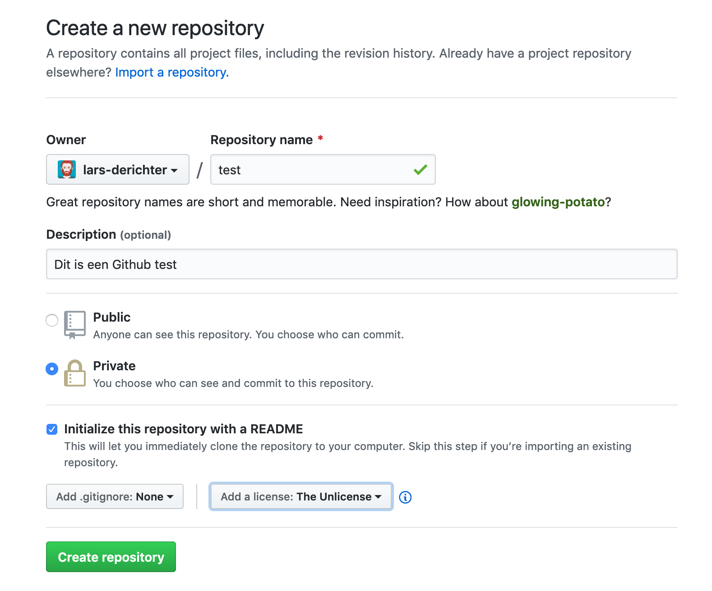
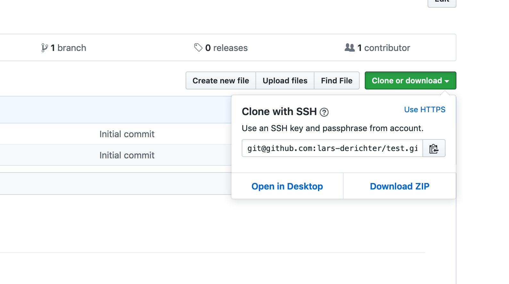
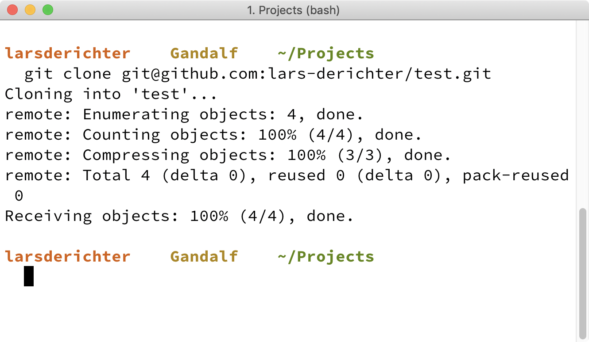

# Version Control

## Slides

We overlopen samen de slides: [01.03 Version control – slides](/slides/01.03.version-control ":ignore").

---

## Workflow voor individuele projecten

Voor als je alleen aan iets werkt, maar je wel de voordelen van Git (en Github) wil.

### Setup

1. Maak een nieuwe repository op Github. Voorzie een description. Kies zelf of je er een Public of Private repository van wil maken. Duid **Initialize this repository with a README** aan. Voeg optioneel een licentie toe.



2. Clone de repository naar je lokale machine. In Git Bash of Terminal ga je naar de hoofddirectory voor je projecten en dan typ je:

```
git clone <repository URL>
```

Nu heb je een directory met de naam van je repository die een lokale versie van de repository bevat met alle bestanden en hun volledige commit-geschiedenis.





### Werk

1. Doe programmeerwerk in je editor (VS Code).
2. `git status` om te controleren welke bestanden je gewijzigd hebt
3. `git add <bestanden>` om de gewijzigde bestanden klaar te zetten om te comitten (in de staging area of index)
4. `git commit -m "<goed logbericht>"` om de wijzigingen toe te voegen aan je Git-geschiedenis
5. `git push` om je aangepaste Git-geschiedenis door te sturen naar Github (zodat je een veilige backup hebt en/of je project met zijn geschiedenis kan delen)

Deze stappen herhaal je zo lang je aan je project werkt.

---

## Workflow voor opdrachten

De workflow om aan de opdrachten bij deze cursus te werken en ze correct in te dienen via Github.

TODO:

---

## Workflow voor groepsprojecten

Dit is nog niet aan de orde, maar als we ooit met groepsprojecten werken, kan je voor je begint dit best even bekijken.

TODO:

---

## Herhalen, oefenen, tutorials

- [What is Git? The 5 Minute Tutorial](https://medium.com/@alanscarpa/what-is-git-the-5-minute-tutorial-daa0df0cc98c): heel goed om mee te beginnen
- [Git - the simple guide](http://rogerdudler.github.io/git-guide/): zeer handige gids met de belangrijkste commando’s
- [Git Basics](https://git-scm.com/videos): video tutorials voor wie alles liever een keer hoort en ziet
- [Git for Designers](https://medium.com/@dfosco/git-for-designers-856c434716e): artikel voor wie het nog niet helemaal snapt en het nog eens op een andere manier wil uitgelegd krijgen
- [Visualizing Git Concepts with D3](https://onlywei.github.io/explain-git-with-d3/): voor de beelddenkers onder ons
- [Basic Git Workflow | codecademy](https://www.codecademy.com/learn/learn-git/modules/learn-git-git-workflow-u): interactieve cursus van codecademy

---

## Referentiemateriaal

- [Oh shit, git!](https://ohshitgit.com): voor wanneer je het verkl\*\*t hebt
- [Visual Git Cheatsheet](http://ndpsoftware.com/git-cheatsheet.html): mooi, visueel overzicht van commando’s
- [How to Write a Git Commit Message](https://chris.beams.io/posts/git-commit/)
- [Git documentation](https://git-scm.com/docs): de officiële ‘handleiding’ voor Git
- [Think Like (a) GitA ](http://think-like-a-git.net): soms begrijp je iets beter door wel alle details te kennen
- [Pro Git](https://git-scm.com/book/en/v2): gratis boek voor als je een echte Git Professional wil worden (ook beschikbaar [in het Nederlands](https://git-scm.com/book/nl/v2))
