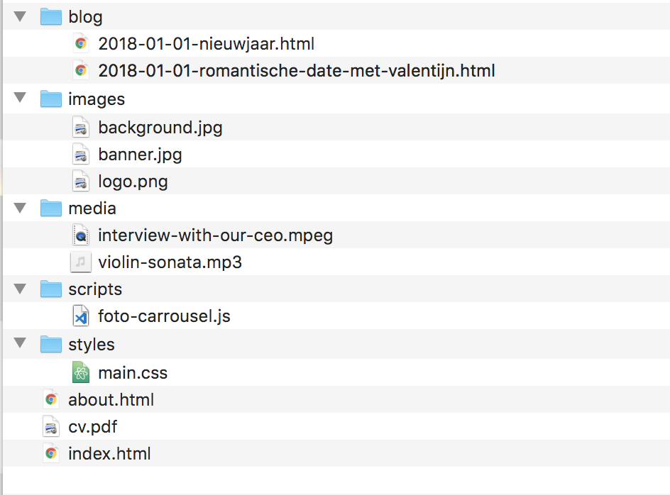

# HTML documenten

## Wat is HTML5?

HTML beschrijft **_DE INHOUDELIJKE STRUCTUUR_** van een webpagina. Dus **niet de presentatie (het uitzicht)**, daarvoor hebben we CSS.

- HTML5 of HTML 5 is de recentste versie van HTML
- HTML = HyperText Markup Language
- Hypertext = tekst met links, het is mogelijk om op een niet-lineaire manier van pagina naar pagina, van bron naar bron te springen
- Markup is wat tekst betekenis geeft voor computers, zo weet de computer wat de verschillende onderdelen zijn van een tekst: bijv. wat een titel is, wat gewone tekst is, wat belangrijk is en wat minder. Met die informatie kan de software de tekst op een overzichtelijke manier weergeven en bijv. ook automatisch een inhoudsopgave aanmaken enz.
- HTML is de markup taal die gebruikt wordt voor webpagina's. Het is zeker niet de enige markup taal, maar wel de meest gebruikte. (Tekstverwerkers zoals MS Word gebruiken intern ook een eigen markup taal.)
- Over het ontstaan en de geschiedenis van HTML lezen we in één van de eerste lessen Engels een tekst en het ontstaan van het internet en het World Wide Web komt aan bod tijdens de lessen Webmarketing en UX. Dat is hier dan ook niet echt van belang.

(HTML is een dochter van SGML en bijgevolg een halfzus, maar ook stiefdochter van XML. Met XML zal je in de loop van het schooljaar misschien ook in contact komen.)

## Wat zijn tags?

### Tags

HTML-elementen worden gemarkeerd met tags:

1. Tags beginnen met een ‘opening bracket’: `<`
2. gevolgd door de naam van de tag bijv. `p`
3. en eindigen met een ‘closing bracket’: `>`

bijv. `<p>`

### Closing tags

Op enkele uitzonderingen na staat tekst (of andere inhoud) steeds tussen een ‘opening tag’ (bijv. `<p>`) en een ‘closing tag’ (bijv. `</p>`):

1. Een ‘closing tag’ begint met een 'opening bracket' gevolgd door een 'forward slash’: `</`
2. dan de naam van de tag (bijv. `p`)
3. en eindigt met een ‘closing bracket’ `>`

bijv. `</p>`

### Volledige tag met inhoud

```html
<p>Dit is een paragraaf</p>
```

### Tags nesten

Je kan ook tags ‘nesten’ of in elkaar steken (zoals Rusissche matroesjka popjes). Dan moet je wel opletten dat je ze in de juiste volgorde sluit, telkens van binnen naar buiten.

bijv.:

`<p><strong>Dit is een belangrijke paragraaf.</strong></p>`

**Verkeerd:**

<del>`<p><strong>Dit is een belangrijke paragraaf.</p></strong>`</del>

### Whitespace

De browser negeert alle vormen van ‘whitespace’ (spaties, returns...). Je kan dus al je markup zomaar aan elkaar plakken. Dat betekent ook dat wanneer je een return in je tekst zet, de browser daar geen nieuwe lijn begint.

Voor de leesbaarheid van je code hebben we de gewoonte om die te ‘indenteren’: geneste block tags (zie verder) zetten we op een nieuwe lijn en laten we inspringen met 4 spaties. Ook de bijbehorende closing tags komen dan op een nieuwe lijn en laten we 4 spaties uitspringen. Zo blijft alles goed leesbaar.

Een goede text editor helpt je daarbij.

## Wat zijn attributen?

- Attributen geven de browser extra informatie over de ihoud van de tag en wat ermee moet gebeuren.
- Een attribuut staat steeds in de opening tag
- Na de naam van de tag volgt een spatie en dan het attribuut
- Attributen hebben de volgende vorm:
  1. Naam van het attribuut; bijv. `class`
  2. `=`
  3. waarde van het attribuut tussen aanhalingstekens (enkel of dubbel maakt niet uit, we gebruiken normaal dubbele); bijv. `"hidden"`

Een tag met een attribuut ziet er dus zo uit:

```html
<p class="hidden">The One Ring</p>
```

Een tag kan ook meerdere attributen hebben, telkens gescheiden door een spatie:

```html
<p class="hidden" id="ash-nazg">The One Ring</p>
```

## HTML5 geraamte

We overlopen samen de [Prezi: HTML5 geraamte.](https://prezi.com/jxhln5bbathh/html5-geraamte/)

## Minimaal, geldig HTML5 document

Het minimale, geldige HTML5 document ziet eruit als volgt:

```html
<!DOCTYPE html>
<html>
  <head>
    <title></title>
  </head>
  <body></body>
</html>
```

- De doctype is noodzakelijk. (Let op die begint met een uitroepteken en wordt niet gesloten.) Zo weet de browser dat hij geldige HTML5 mag verwachten (anders kom je met Internet Explorer in ‘Quirks Mode‘ terecht, wat aanleiding kan geven tot allerlei bizarre bugs.)
- De html-tag vertelt van waar tot waar het HTML document loopt.
- Er moet een head en een body zijn
- In het head moet een title-tag aanwezig zijn.
- Alle tags moeten correct genest zijn en gesloten worden.

?> Oefen deze structuur tot je hem van buiten kent. Dit moet je kunnen zonder iets op te zoeken. Als je zeker bent dat je dit onder de knie hebt, vraag je om de toets hierover te doen.

!> **Toets:** je kondigt aan dat je de toets wil doen, je sluit alles af, je neemt een blaadje en schrijft een minimaal, geldig HTML5 document uit.

## Inhoud

Uiteraard wil je je pagina ook inhoud kunnen geven. Voorlopig beperken we ons tot tekst: koppen (titels, kopjes, hoofden of hoe je die dingen ook wil noemen) en paragrafen.

Voor kopjes heb je zoals bij een tekstverwerker verschillende niveaus. Je kan dit best vergelijken met de stijlen ‘kop 1’, ‘kop 2’ … in MS Word. In HTML heb je de tags h1 tot h6 voor respectievelijk ‘heading 1‘ tot ‘heading 6‘. Hopelijk heb je het zesde niveau nooit in het echt nodig, maar weet dat het bestaat.

```html
<h1>Een titel van het eerste niveau</h1>
<h2>Een titel van het tweede niveau</h2>
...
<h6>Een titel van het zesde niveau</h6>
```

Voor paragrafen hebben we de p tag.

```html
<p>Een eerste paragraaf tekst</p>
<p>En nog één</p>
```

## Commentaar

Soms wil je als ontwikkelaar commentaar in je code kunnen zetten die de gewone bezoeker niet te zien krijgt.

Dat kan om allerlei redenen handig zijn:

- een boodschap voor wie je code zou willen overnemen (bijv. een licentie);
- een stukje dat je nog wil herwerken aanduiden;
- een plaats waar je iets doet wat op het eerste gezicht onlogisch lijkt aanduiden;
- om de structuur van je code verder te verduidelijken.

Het is eigenlijk een goed idee om telkens wanneer je ergens lang over hebt moeten nadenken dat even te documenteren met een commentaar. De kans dat iemand anders (of jijzelf een paar maanden later) weet hoe en waarom je een lastig probleem hebt aangepakt zonder een beetje uitleg begrijpt is kleiner dan je zou denken.

In HTML hebben we een speciaal soort tag om zo een commentaar aan te duiden (en verborgen te houden voor de bezoeker die niet naar je code komt kijken (vergeet nooit dat iedereen dat meteen simpele toetsaanslag kan). Hij begint met kleiner dan `<`, gevolgd door een uitroepteken `!` en twee koppeltekens `--`, om aan te geven dat je klaar bent met je commentaar zet je twee koppeltekens `--`, gevolg door groter dan `>`.

```html
<!-- Deze commentaar wordt genegeerd door de browser -->
<p>Deze tekst wordt getoond in de browser</p>
```

Je kan zelfs tags in een commentaar zetten. Dat is trouwens een trucje om een stukje HTML tijdelijk te verbergen voor de browser.

```html
<p>Welkom op deze pagina</p>

<!-- Het volgende moet enkel getoond worden tijdens de eindejaarsperiode -->
<!-- <p>Prettige feestdagen</p> -->
```

### Meer weten

[HTML Comments - Getting started with HTML | MDN](https://developer.mozilla.org/en-US/docs/Learn/HTML/Introduction_to_HTML/Getting_started#HTML_comments)

## Voorbeeldpagina met inhoud

[Voorbeeldpagina met inhoud – code](https://github.com/7-WN/webontwikkeling-cursus/blob/master/cursus/02.html-css-basis/_examples/voorbeeld.html)

[Voorbeeldpagina met inhoud – resultaat](/cursus/02.html-css-basis/_examples/voorbeeld.html ":ignore")

## class & id – de belangrijkste attributen

De twee attributen die je het vaakst zal gebruiken (en die je voor elke tag in de body mag gebruiken), zijn class en id.

### class

Het class-attribuut gebruik je om aan te geven dat bepaalde elementen gemeenschappelijke kenmerken hebben. Later kan je deze elementen dan via CSS of JavaScript oproepen om ze op dezelfde manier op te maken of om ze dezelfde functionaliteiten te geven.

```html
<html>
  ...
  <body>
    <h1>Computer & Techniek nr. 367</h1>
    <article>
      <h2>Artikel 1</h2>
      <p class="summary">Paragraaf met een samenvatting van artikel 1.</p>
      <p>Tekst</p>
      ...
    </article>
    <article>
      <h2>Artikel 2</h2>
      <p class="summary">Paragraaf met een samenvatting van artikel 2.</p>
      <p>Tekst</p>
      ...
    </article>
    ...
  </body>
</html>
```

Een element kan ook meerdere classes hebben. Dan zet je tussen de aanhalingstekens gewoon een lijstje van namen met een spatie ertussen (de volgorde is niet belangrijk). (Dit verklaart meteen waarom je geen spatie kan gebruiken in een classname.)

```html
<html>
  ...
  <body>
    <h1>Computer & Techniek nr. 367</h1>
    <article class="lead-article opinion">
      <h2>Artikel 1</h2>
      <p class="summary">Paragraaf met een samenvatting van artikel 1.</p>
      <p>Tekst</p>
      ...
    </article>
    <article class="normal-article opinion">
      <h2>Artikel 2</h2>
      <p class="summary">Paragraaf met een samenvatting van artikel 2.</p>
      <p>Tekst</p>
      ...
    </article>
    ...
  </body>
</html>
```

### id

Met het id-attribuut geef je het element een unieke naam. Zo kan je dit element zijn eigen opmaak of functionaliteit geven met behulp van CSS of JavaScript of om ernaar te linken. Je browser zal geen foutmelding geven als je per ongeluk toch twee elementen binnen hetzelfde document dezelfde id zou geven, toch is dat een slecht idee en kan dat tot onverwachte resultaten leiden. (Als je je text-editor correct hebt ingesteld, krijg je daar wel een waarschuwing.)

Je kan het class-attribuut en het id-attribuut uiteraard combineren.

```html
<html>
  ...
  <body>
    <h1>Computer & Techniek nr. 367</h1>
    <article class="lead-article opinion" id="article-1">
      <h2>Artikel 1</h2>
      <p class="summary">Paragraaf met een samenvatting van artikel 1.</p>
      <p>Tekst</p>
      ...
    </article>
    <article class="normal-article opinion" id="article-2">
      <h2>Artikel 2</h2>
      <p class="summary">Paragraaf met een samenvatting van artikel 2.</p>
      <p>Tekst</p>
      ...
    </article>
    ...
  </body>
</html>
```

### Meer weten

- [class - HTML | MDN](https://developer.mozilla.org/en-US/docs/Web/HTML/Global_attributes/class)
- [id - HTML | MDN](https://developer.mozilla.org/en-US/docs/Web/HTML/Global_attributes/id)

## Mappen en bestanden

### Mappenstructuur

Een volledige website bestaat natuurlijk uit meerdere pagina’s met onderlinge links en naast de html-documenten zijn er ook documenten die het uitzicht van de website bepalen, afbeeldingen, pdf-documenten, scripts, media-bestanden …

Sommige websites bestaan uit 1000’en bestanden. Je begrijpt dat het belangrijk is om een goede, overzichtelijke structuur te gebruiken om al deze bestanden te organiseren.

De meeste webontwikkelaars hanteren een structuur waarbij bestanden per soort worden samen gezet. Vaak worden er daarnaast mappen voorzien voor soorten pagina’s waarvan we verwachten dat het aantal zal blijven toenemen (blog posts, fotoalbums, producten, categorieën, etc.)

Hieronder vind je een voorbeeld van een typische mappenstructuur voor een eenvoudige website.



Het belangrijkste is dat je nagedacht hebt over een structuur en dat die structuur voor een buitenstaander meteen duidelijk is (door de naamgeving van bestanden en mappen) waar hij een bepaald document kan vinden of moet toevoegen.

### Waar vind ik (of de server) de homepage?

Als bezoeker van een website wil je naar de homepagina van een website kunnen surfen door `www.scheppers.be` in te voeren in de adresbalk en niet `www.scheppers.be/de-homepagina-van-onze-school.html`. Om dat te kunnen doen moet de webserver weten welk document hij moet doorsturen als start-pagina.

Daarvoor is er een afspraak tussen alle webservers en webontwikkelaars. De startpagina noemen we index. Als het om een html website gaat is je startpagina dus **index.html** Vanaf nu zorg je dus altijd dat er een index.html document in je website zit en als je website maar uit één pagina bestaat, noem je het bestand, je raadt het al, index.html

### Hoofdletters en spaties

Een laatste opmerking: vermijd hoofdletters en spaties in bestandsnamen voor websites. Windows en Unix/Linux (68% van de webservers) en ook de http-protocollen gaan verschillend om met hoofdletters en spaties in bestandsnamen. Om later miserie en moeilijk te vinden bugs te vermijden, gebruiken we **geen spaties of hoofdletters in bestandsnamen voor een website!**

Vervang spaties door koppeltekens (die zijn duidelijk en google blijkt er ook een voorkeur voor te hebben.)

### Meer uitleg

[Dealing with files - Learn Web Development | MDN](https://developer.mozilla.org/en-US/docs/Learn/Getting_started_with_the_web/Dealing_with_files)

## Portfolio v0

!> Maak nu de opdracht: **Portfolio-v0** TODO:
